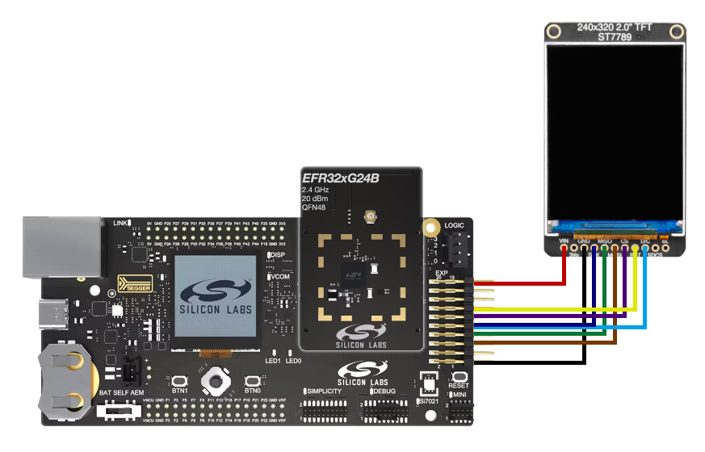
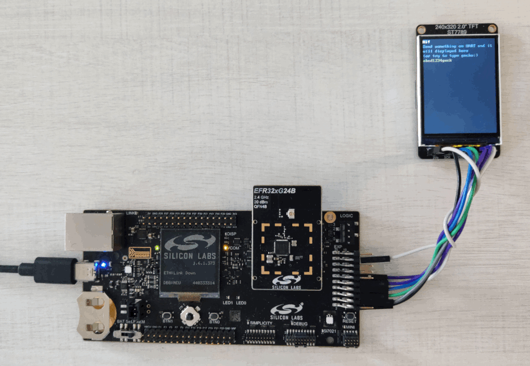

# Zephyr - ST7789 SPI display demo #

## Summary ##

This example demonstrates how to use Zephyr OS on Silicon Labs development kits. It shows how to use SPI communication with the MIPI driver class.

The application displays all characters received over the VCOM UART.

## Zephyr version ##

- [Zephyr 4.2.0](https://github.com/zephyrproject-rtos/zephyr/tree/v4.2.0)

## Hardware Required ##

- 1x [Wireless Pro Kit Mainboard](https://www.silabs.com/development-tools). Tested boards for working with this example:

   | Board ID | Description |
   | -------- | ----------- |
   | BRD4002A | [Si-MB4002A](https://www.silabs.com/development-tools/wireless/wireless-pro-kit-mainboard?tab=overview) Wireless Pro Kit Mainboard |
   | BRD4187C | [xG24-RB4187C](https://www.silabs.com/development-tools/wireless/xg24-rb4187c-efr32xg24-wireless-gecko-radio-board?tab=overview) EFR32xG24 Wireless 2.4 GHz +20 dBm Radio Board |
   | ST7789 | [ST7789 Display module](https://www.adafruit.com/product/4311?srsltid=AfmBOooETrfR3_XEf72rTXPhj_-rw8gguEbTIHD6PH5B4lxcD77hl9VC) 2.0" 320x240 Color IPS TFT Display with microSD Card Breakout - ST7789 EYESPI |

## Connections Required ##

You need a USB cable to connect the kit mainboard to your computer. The following picture and table show how to connect the ST7789 to the SPI MIPI interface.

   | WPK Mainboard | ST7789 module |
   | -------- | ----------- |
   | EXP18 | VIN |
   | - | 3VO |
   | EXP01 | GND |
   | EXP08 | SCK |
   | EXP06 | MISO |
   | EXP04 | MOSI |
   | EXP10 | CS |
   | EXP11 | RST |
   | EXP07 | D/C |
   | - | SDCS |
   | - | BL |

## Setup ##

To run the example, follow these steps:

1. Run the **Command Prompt** as administrator, initialize the workspace for the project, and download the required packages. Please refer to the [setting up environment](../../README.md#setting-up-environment) section.

2. Change the current working directory to the `zephyrproject` directory using the `cd` command.

3. Build this project using the following commands with one of the tested boards:

   - Si-MB4002A + xG24-RB4187C: **`west build -p -b xg24_rb4187c zephyr_applications/applications/zephyr_st7789_demo`**

4. Flash the project to the board using **`west flash`** command.

**Note:**

- Make sure the Zephyr OS environment is already installed. To install it, refer to [this guide](../../README.md#setting-up-environment).

- You need to install the SEGGER RTT J-Link driver to flash this project to the board. For more information, refer to [this section](../../README.md#flash-the-application).

## How It Works ##

This example demonstrates how to connect and use a display with SPI. Since the Character Frame Buffer [CFB](https://docs.zephyrproject.org/latest/samples/subsys/display/cfb/README.html) only supports MONO10 or MONO01 pixel format, this example adds basic character rendering for RGB565 pixel format without using [LVGL](https://docs.zephyrproject.org/latest/samples/subsys/display/lvgl/README.html).

Besides character rendering, it is possible to display graphics by sending the "efr32" keyword over the VCOM UART.

All sent characters will be shown on the display.

